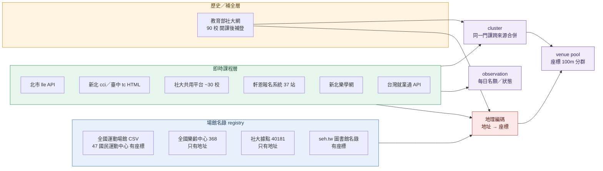

# 成人課程資料來源實測（2026-09-11）

README v0 只列了來源。本文逐一實際抓取，記錄抓得到什麼、有多新、怎麼接，並修正 v0 裡已經失效的說法。機器可讀的來源清單見 `sources.tsv`。

---

## 0. 結論

1. **社大全國站是補登的歷史檔，不是即時來源。** 抽樣 30 門 115 春季課，29 門在開課後才建檔，建檔日減開課日的中位數是 **+50 天**。截至 9/11，115 秋季只有 6 所社大、821 門課上傳；115 春季則有 90 所、11,549 門。所以「現在可報名」要靠縣市聯網或社大自己的報名平台，全國站只用來補全國覆蓋與歷史資料。
2. **即時資料其實比 v0 預期好抓。** 北市社大聯網有免登入的 JSON API（6,045 門，含招生中／額滿狀態），台灣就業通也有（2,397 門）。運動中心的課表在線上報名系統裡是結構化 HTML，**不必解析 PDF 簡章**。
3. **接入單位是「系統廠商」，不是單位本身，也不是營運商。** 同一套報名系統會被好幾家營運商共用：
   - 運動中心：軒恩（xuanen）的報名系統被救國團、舞動陽光、新北多館、士林 YMCA 共用，**一支解析器至少可以接 37 個報名站**。
   - 社大：`/course/m_course_detail.php?u=` 這套平台有 26 個主機名稱在用，約 30 所社大。
4. **地址是整合的瓶頸。** 社大課程只有地址文字、沒有座標，而且寫法很亂（「豐東國中」「市立大里高中」「濟南路一段六號」）。拿教育部「社大據點」名錄做字串比對，以課程筆數算只對上 45.9%。seh.tw 規格的 venue pool 用座標做 100m 分群，所以這題**得先做地理編碼**。
5. **seh.tw 的 venue pool 目前只有規格，還沒有資料。** seh.tw 的 `transform/` 只有三份 md，正規化、分群的程式都還沒寫（見 seh.tw README「待做」）。現在能共用的是 ingest 的原始名錄與 `CONTRACT.md` 格式。

---

## 1. 各類來源實測

### 1.1 社區大學

| 來源 | 端點 | 實測 | 即時性 | 備註 |
|---|---|---|---|---|
| 教育部全國社大網 | `POST https://cc.moe.edu.tw/view/public_page/pub_load_ajax.php`，form 參數 `user_id=0`、`json_str_aes=<明文 JSON>`、`aoData=[]`；`act_type=load_course_list` 可一次取 20,000 筆 | 全部 125,987 門；115 春 11,549 門、90 所 | **落後**，中位數開課後 50 天建檔 | 名字叫 aes，但公開頁不加密（`okb_key=""`）。`load_school_quarter_list` 回傳 22 縣市、90 所社大、24 個期別；`load_course_content` 可取簡介、學程類別（學術／生活藝能／社團）、建檔與審核時間 |
| 北市社大聯網 | `GET https://lle.tp.edu.tw/api/course?limit=5000&page=N` | 6,045 門；115 秋已有 1,541 門社大課（7 所） | 即時（課程 `createdAt` 在開課前） | 另含樂齡學堂 286、樂齡中心 208、成人教育班等。`openStatus`：招生中 3,941／額滿 1,521／開課中／停招。**README 寫的 ccwt.tp.edu.tw 已改為 lle.tp.edu.tw** |
| 新北社大聯網 | `https://cci.ntpc.edu.tw/cht/index.php?code=list&ids=15&page=N`（伺服器端 HTML，1,742 頁） | 約 17,000 門（含歷史） | 即時，已有 11 月開課的課 | 列表欄位：開課日、分類、行政區、社大、課名、教師、星期、開課狀況（招生中／開課中／額滿／停招） |
| 社大共用報名平台 | `https://<校>.<twcc/twcu/twco/tycc/course>.org.tw/course/m_course_list.php` | 科學城社大 115 秋 66 門 | 即時 | 26 個主機名稱、約 30 所社大共用。列表上有「開／滿／停開」旗標。detail 連結的 `u=` 雜湊每學期會換（舊連結回 302） |
| 臺中社大聯網 | `GET https://cc.tc.edu.tw/application/index/course-search-data?semester_state=383&kind=courseTabList&page=N`（回傳 HTML 片段，每頁 10 筆） | 115 秋 44 頁，約 430 門（9/11 當下） | 即時 | 有**報名人數／名額**（如 `0 / 30`）、開課狀況（公布／停召／額滿／已開課） |
| 其他縣市聯網 | 見 `sources.tsv` | 首頁指紋 | — | 新竹縣、南投、澎湖、花蓮首頁已出現 115 學期字樣；基隆 404、金門 403、臺東回 StateError、宜蘭首頁只有 659 bytes |

全國站 `course_url` 欄位的網域分群（115 春）：`twcc.org.tw` 11 所、`twcu.org.tw` 9、`twco.org.tw` 4、`course.org.tw` 4、`tycc.org.tw` 4，其餘各校自架。雲林 4 所共用 `/govermentAPI/course.php`。

全國站欄位品質（115 春，11,549 筆）：地址 97.0%、時段 98.8%、日期 100%、收費 95.3%、有課程網址 92.3%、教師 100%。`teach_status` 全部是 1，篩選「停開」沒有作用（送 0 或 1 回傳筆數都一樣），**來源不回報停開**。

### 1.2 運動中心

| 來源 | 實測 |
|---|---|
| 全國運動場館資訊 CSV（dataset 22849） | 15,001 列、9,861 個場館；「國民運動中心」屬性 47 座，有座標。**官網欄位不可靠**：泰山（xwtsc.com）網域已過期被轉賣，淡水（tssc.tw）導向垃圾站，蘆洲（lzcsc.cyc.org.tw）DNS 查不到 |
| 臺北市各區運動中心（data.taipei 121203） | 12 座，有座標與官網 |
| **軒恩報名系統**：`<站>.aspx?Module=class_booking&files=class_info&B=<類別>` | 伺服器端 HTML 週課表，每門課都有：教師、課名、課程代碼、教室、起訖日、星期時段、**滿班人數、可報名人數**。中山運動中心 10 個類別合計 191 門 |

軒恩系統上已確認有課的站點：

- 救國團 `scr.cyc.org.tw/tpNN.aspx`：tp01 中山、09 汐止、10 永和、11 朝馬、12 內湖、13 桃園、15 中壢、16 竹光、17 林口、18 八德、20 文山、25 南港、26 北屯，另有 tp22／23 等非運動中心站點。
- 舞動陽光 `bwd.xuanen.com.tw/wdNN.aspx`：02、04、08、14、16、22、25、26、27、28、30、31、32、33、34、36、37，共 17 站（例如 wd02 大同、wd26 彰北、wd27 中正）。
- 其他：`fe01` 三重、`ds02` 宜蘭、`bq01` 板橋、`nt01` 樹林、`ymca.com.tw/slsc68` 士林。`nd01` 南屯回傳「連線異常」。

其他報名系統：17fit（南平、五股、平鎮）無論打哪個路徑都會導到 `/studios`，頁面是 rate-limit 等待頁（「Processing, this may take a few minutes」）。依 seh.tw `CONTRACT.md`「禁止繞過防護」，這三館**不接**。bookfastpos（前金）只有一館，還沒解析。`booking.tpsc.sporetrofit.com` 是北市場地租借，沒有課程。

### 1.3 樂齡／長青（兩套行政體系）

| 來源 | 實測 |
|---|---|
| 全國樂齡學習中心聯繫資料（dataset 163769） | 368 所，只有地址、沒有座標，是 entity 種子 |
| 教育部樂齡學習網 | **沒有公開課程查詢**。「課程查詢」連到 socialedu2，會導向講師登入頁。依 seh.tw `CONTRACT.md`，需要登入的來源不能接 |
| 新北數位樂學網 `https://ezlearn.ntpc.gov.tw/courses` | 1,026 門，伺服器端 HTML，詳情頁是 `/courses/detail/<id>`；有報名起訖、開課日、類別、地區、承辦單位、招生人數。涵蓋樂齡中心、松年大學、婦女大學 |
| 北市樂齡 | 已包含在 lle.tp.edu.tw API 裡 |
| 長青學苑（社會局體系） | 臺中 dataset 91935 欄位最完整（44 欄，含報名期間、名額、課程狀態、TWD97 座標），但只有 113 年資料。來源系統 `old65.taichung.gov.tw` 還在運作，資料集沒跟上 |

「樂齡」（教育部）和「長青學苑」（社會局）是兩套平行體系，對象都是 55 或 65 歲以上，v0 只列了前者。

### 1.4 圖書館

- seh.tw 已經有 `national-public-libraries`（全國公共圖書館名錄，有座標），以及北市、高雄、臺南、屏東的分館名錄；活動類只有 `ncl-events`（RSS，固定最新 10 筆）。
- **README 的兩個網址已失效**：`actio.ncl.edu.tw` DNS 查不到；國資圖的 `ActivityInfoListC001200.aspx` 回 400，新路徑是 `/activityinfo/recap/audiences/樂齡`、`/types/講座`。
- 北市圖用的是政府網站 CMS（`News_Content.aspx`），活動寫成新聞稿，沒有結構化欄位。
- 開放資料有國臺圖 XML（dataset 40300、40301）和國資圖講座 XML（137298），但量都小。

圖書館這層投入產出比最低，建議最後才接。

### 1.5 職業訓練

| 來源 | 實測 |
|---|---|
| dataset 6060 | **只有 467 筆**，全部是五個分署自辦。v0 寫「XML 一年數千筆」不對 |
| dataset 6614 分署自辦在職 | 118 筆，每月更新 |
| **台灣就業通** `POST https://course.taiwanjobs.gov.tw/api/Course/paging`，form 參數 `Limit`、`Offset`、`SourceType`、`TrainingPeriod=1` | 近期課程共 2,397 門，免登入：職前 288、分署自辦在職 48、青年專班 5、產業新尖兵 103、其他政府單位 110、**產業人才投資方案 1,827**、區域產業據點 16。有報名起訖、訓練起訖、職類代碼、`UpdateTime` |

結論：職訓直接接台灣就業通這一支就好，6060 已被它涵蓋。

### 1.6 目錄裡另外找到的

`sources.tsv` 另外列了林業保育署自然教育中心課程（dataset 70984，124 筆）、經濟部人才培訓（8797）、北市銀髮族據點課程（121911，420 筆）、臺南長青學苑（172378）等，都是結構化資料，但量小或更新慢，可列為第二階段。

---

## 2. 統整方式

### 2.1 課程身分（cluster key）

同一門社大課最多會出現在三處：全國站、縣市聯網、社大自己的平台。

| 規則 | 可用欄位 | confidence |
|---|---|---|
| 社大 ＋ 期別 ＋ 校內課程代碼 | 全國站 `internal_course_code` 和北市 `code` 是**同一個值**（實測 `1151C9003`、`261083` 兩邊一致） | 1.0 |
| 社大 ＋ 期別 ＋ 正規化課名 ＋ 星期 ＋ 開始時間 | 三個來源都有 | 0.9 |
| 社大 ＋ 期別 ＋ 教師 ＋ 星期 | 課名有改時的備援 | 0.7 |

實測（北市 12 所，115 春）：只用正規化課名比對，全國站 2,520 門中有 2,247 門對上北市 API（89%）。但同名不同班會誤配，例如「紓緩養身瑜珈」全國站是 C7017、週六，北市對到的是 C7015、週五。所以代碼要排在第一。士林只對上 15/152，是因為北市 API 裡士林 115 春只有 31 門。

兩邊命名都不一致，需要寫死的對照表：

- 社大名稱：北市 API 同時出現「士林社區大學」「臺北市士林社區大學」「松山社大」。
- 期別：全國站 `quarter=1152`、北市「115年度秋季班」，但大安、文山、中正寫成「115年度第2期」；社大平台寫「115-秋季班」；臺中是「115 年度 - 第 2 學期 (秋)」，`semester_state=383`。

### 2.2 場館

- 運動中心：registry 有座標，軒恩站點對到場館是一次性的人工對照表（約 37 筆），做法同 seh.tw 的 `defaultVenue`。課表裡的「教室」欄就是廳名。
- 社大：課程地址 → 地理編碼 → 100m 分群 → 掛到社大據點或新建 derived venue。115 春全國站有 1,304 個不同地址，要做地理編碼。
- 樂齡：368 所名錄也要地理編碼。

**地理編碼：TGOS（2026-09-11 定案）**

TGOS 全國門牌地址定位服務分兩級（依 https://www.tgos.tw/tgos/Addr）：

| | 一般使用 | 進階使用 |
|---|---|---|
| 資格 | 所有 TGOS 會員 | 政府機關、法人機構、學術單位、業界，要審核 |
| 方式 | 網頁上傳 CSV 做批次比對，1～2 天後寄信通知下載 | API（APPID ＋ APIKEY） |
| 額度 | 每日 1 萬筆 | 每月 30 萬筆 |
| 限制 | 要人工上傳與下載 | **綁定 IP**，異動要交用印的紙本申請單 |

先用一般使用。首批不重複門牌 1,935 筆，一次就能送完；之後每學期只需送新增的門牌。以地址字串為 key 建快取，已編碼的不重送。新課程在座標回來前 1～2 天的空窗，照 seh.tw 懸空邊的做法處理：頁面照常顯示，只是暫時不連到場館頁。等需要全自動每日跑、而且有固定 IP 的主機時，再申請進階。

產生上傳檔：`python3 geocode/build_tgos_input.py`，輸出在 `geocode/out/`。實跑結果（2026-09-11）：

- 來源：教育部社大網 115 春＋秋、社大據點 114 年起、全國樂齡中心、北市社大聯網，共 20,078 筆地址記錄。
- 可直接當門牌 17,635 筆；校名或據點名換成門牌 1,474 筆；未解析 969 筆（4.8%，318 種字串）。
- 換門牌的依據：先查同一所社大的據點名錄，再查教育部國小、國中、高中、大專名錄。都要唯一命中才採用。
- 未解析的主要是「戶外」「線上課程」「嘉義縣朴子市」這類本來就不是門牌的字串，另有少數名錄裡查不到的校名（例如總爺國小）。這些照 seh.tw 的 `venue-unmatched` 待辦處理，依出現次數排序在 `unresolved.csv`。

回填結果：`python3 geocode/import_tgos_results.py <TGOS結果檔.csv>`，累積成 `geocode/out/geocoded.csv`（地址→座標快取，下批只送沒編碼過的）。結果檔欄位命名有多種寫法（`Response_X`／`X`／`經度`…），已做容錯；座標若回傳二度分帶會轉成 WGS84。

轉換程式的驗證（2026-09-12）：全臺網格 875 點（121 帶）與離島 144 點（119 帶）對 pyproj 9.8.1，最大誤差 0.06 公釐；對成大水工所公布的對照座標（162615.934, 2550191.182 → 120:08:50.19220, 23:03:03.79624）差 0.07 公分。

### 2.3 Observation（名額）欄位對照

| 來源 | 名額／狀態欄位 |
|---|---|
| 軒恩 | 滿班人數、可報名人數（數字） |
| 臺中社大聯網 | 報名人數／名額（數字）、開課狀況 |
| 北市 lle | `openStatus`：招生中／額滿／開課中／停招／即將開課 |
| 新北 cci | 開課狀況：招生中／開課中／額滿／停招 |
| 社大共用平台 | 開／滿／停開 旗標 |
| 新北樂學網 | 招生人數、報名起訖 |
| 台灣就業通 | 報名起訖（沒有名額） |
| 教育部社大網 | 沒有（`teach_status` 一律是 1） |

只有軒恩系統和臺中聯網給得出數字型名額，其他都是狀態列舉。統一的 `enrollmentStatus` 值域建議定為 `open | full | running | closed | cancelled | unknown`。

### 2.4 規模修正

| 類 | v0 估計 | 實測 |
|---|---|---|
| 社大 | 每季 15,000–25,000 | **每學期約 11,500**（全國站 113–115 春秋都是 10,600–11,600） |
| 運動中心 | 每期每館 50–200 | 中山 191 門。約 50 館推算每期 5,000–10,000（只量了一館，屬推估） |
| 職訓 | 開放資料數千筆 | 台灣就業通近期 2,397 門 |
| 樂齡 | — | 新北 1,026、北市約 500；其他縣市沒有集中來源 |

---

## 3. v0 README 需要更正的地方

- §1.1 臺北市社大聯網網址已改為 `https://lle.tp.edu.tw/`，而且有 JSON API。
- §1.1 全國站「有進行狀態與開課狀態」：進行狀態是前端依日期算出來的；開課狀態實際不回報停開。
- §1.3「課程以 PDF 簡章＋線上報名」：軒恩系統的課表是結構化 HTML，§5 第 3 項（PDF 抽取評估）可以取消。
- §1.4 `actio.ncl.edu.tw` 已失效；國資圖活動列表網址已改。
- §1.5 dataset 6060 只有 467 筆分署自辦課程，不是數千筆。產投方案要從台灣就業通 API 抓（1,827 門）。
- §4 社大規模應為每學期約 11,500 門。

## 4. 還沒實測的

以下都是單館或單縣的長尾，入口已記在 `sources.tsv`：

- 非軒恩系統的運動中心：bookfastpos（前金）、凱格（臺中北區）、新莊、大安、蘆竹。南屯的軒恩站點目前回傳「連線異常」。
- 南投、新竹縣、澎湖、花蓮（cloudschool）等縣市社大聯網的欄位與分頁。這些縣市的社大都在全國站裡，可以先用全國站當歷史層。
- 22 縣市公共圖書館的活動頁。
