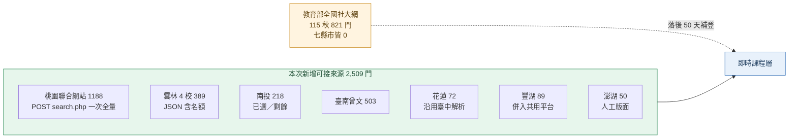

# 未解析來源實測（2026-09-13）

`probe/sources.tsv` 在 2026-09-11 留下 9 個「未解析」的來源：當時只確認站台存在，沒查出取資料的方法。本文逐一實際抓取，記錄端點、欄位、實測筆數與建議。體例接 `probe/2026-09-11-sources.md`。

---

## 0. 結論

1. **9 個裡 7 個可接，1 個不接，1 個要換端點。** 不接的是 bookfastpos（前金運動中心）：課表 API 回「不是合法的 API 呼叫者」，依 `ingest/CONTRACT.md` §2 不繞過。要換端點的是國資圖：舊路徑分頁壞掉，真正的來源是另一個網域的報名平台。
2. **社大這 6 個縣市加起來有 2,509 門 115 秋課，教育部全國站一門都沒有。** 全國站 115 秋（quarter `1152`）目前只有 821 門、6 所社大，雲林／桃園／臺南／新竹縣／南投／澎湖／花蓮**七個縣市在 1152 是零筆**。所以這批不是「全國站的子集」，是全國站補登前唯一拿得到的即時資料。
3. **兩個縣市其實不需要寫新解析器。** 新竹縣聯網（hccu）自己的課程頁是 104 學年度的廢棄資料，它的「最新課程」連到社大共用報名平台；缺的只是 `fonghu.course.org.tw` 沒被列進 `cc-shared-platform.mjs` 的 HOSTS。花蓮則和臺中社大聯網是**同一套廠商系統**（打錯參數時回的錯誤頁標題直接是「臺中市社區大學社區共學Full聯網」），`taichung-cc.mjs` 的 `parseRows` 欄位順序完全相同。
4. **名額數字的來源多了兩個。** 09-11 的結論是「只有軒恩系統和臺中聯網給得出數字型名額」，現在要加上**南投**（`已選：24／剩餘：11`）與**雲林**（JSON 的 `c_now` / `c_UpperLimit` / `full`）。
5. **桃園的 1,206 門是「名單上重複、實際上唯一」。** 桃園 5 所社大的主機都在 `cc-shared-platform.mjs` 的 HOSTS 裡，但 2026-09-12 那輪實測 5 站全部 503，`ingest/raw/cc-shared-platform.json` 裡桃園是 0 筆。聯合網站是同一批課的另一個入口，且**一次請求就能全量取回**。

---

## 1. 各來源實測

### 1.1 `yunlin-cc` 雲林 4 社大

四校共用同一套系統，但站台擺放位置分兩型，AJAX 路徑不同——這是 09-11 沒解開的主因：

| 校 | 課表頁 | 資料端點（POST） | `year` |
|---|---|---|---|
| 海線 `www.seacoast.url.tw` | `/SchoolTimetable.php` | `/ajax/SchoolTimetable-data.php` | 64 |
| 虎尾溪 `www.favorlangriver.url.tw` | `/govermentAPI/SchoolTimetable.php` | `/govermentAPI/SchoolTimetable-data.php` | 53 |
| 平原 `ylpucu.url.tw` | `/govermentAPI/SchoolTimetable.php` | `/govermentAPI/SchoolTimetable-data.php` | 53 |
| 山線 `www.ylsxcu.url.tw` | `/govermentAPI/SchoolTimetable.php` | `/govermentAPI/SchoolTimetable-data.php` | 51 |

- 後三校的**根目錄回 403／404**（`/`、`/index.php`、`/robots.txt` 皆然），只有 `/govermentAPI/` 底下的頁面活著。`sources.tsv` 記的 `/govermentAPI/course.php?N` 是**單筆詳情**，不帶參數時 302 導到同目錄的 `SchoolTimetable.php`——這個 302 就是找到列表的線索。
- `year` 是**各校自己的期別流水號**，同一個 53 在虎尾溪是「115年第二學期」、在平原是「115-2秋季」；海線的 115 秋是 64。**必須先讀課表頁的 `<select name="year">`，不能寫死**（寫死成 2／3 會抓到 2021 年的舊資料，實測過）。
- 回傳 JSON（`content-type` 標成 `text/html`，內容是 JSON），一次一期全量、不分頁。
- 欄位：`c_sn`、`c_StartDate`、`c_name`、`c_week`、`c_StartTime`、`c_EndTime`、`c_times`、`c_now`（已報名）、`c_cost`、`c_UpperLimit`（名額）、`teacher_name`、`FeeLabelName`、`label_name`、`ct_name`（學術性／生活藝能）、`p_area`（鄉鎮）、`place_name`（上課地點）、`full`（額滿旗標）、`c_state`。
  **四校欄位不完全一致**：海線與虎尾溪有 `place_name`／`nonpay`／`label`，平原與山線沒有，且平原與山線的 `c_now` 是數字型別、其餘兩校是字串。解析時不要假設欄位齊全。
- 單筆詳情 `GET /govermentAPI/course.php?<c_sn>`（HTML）：學分費／場地費／教材費分列、上課地點、逐週課程大綱。`c_sn` 與教育部全國站 `course_url` 的 query id 是**同一組值**（實測海線 MOE 端 id 範圍 2811–2997，本期 `c_sn` 3001 起），可直接當 cluster key。

**實測（2026-09-13，115 秋）**：海線 106、虎尾溪 126、平原 84、山線 73，**合計 389 門**。額滿旗標：虎尾溪 10 門、山線 6 門、海線 8 門額滿。收費欄有值的比例 96%（389 門中 372 門 `c_cost` > 0）。

### 1.2 `taoyuan-cc-portal` 桃園市社大聯網

- 首頁 `https://ta.twcc.org.tw/cc/` 會 302 到 `/front/index.php?cc_name=`，是純前端頁（顯示「載入中…」），所以 09-11 的首頁指紋看不到 115 字樣。
- 端點：**`POST https://ta.twcc.org.tw/front/search.php`**，form 參數 `offset`、`limit`、`semester`、`category`、`coursetype`、`cc_name`、`week`、`interval`、`keyword`、`discount`。回傳 HTML 卡片片段，開頭有 `找到 1206 筆`。
- **`limit=2000` 一次回 1,206 筆全量**（827 KB），沒有伺服器端截斷跡象。`offset` 分頁也正常（`offset=30` 回下一批 30 筆）。
- 選單值另有 7 支 JSON 端點：`get_semesters.php`（回 `["全部","115-秋季班","116-春季班"]`）、`get_categories.php`、`get_cities.php`、`get_organizers.php`、`get_types.php`、`get_weeks.php`、`get_intervals.php`。
- 列表欄位：課名、主辦單位、學期、類型（實體課程）、類別（生活藝能－養生保健類）、開課日期＋星期＋時段。
- 詳情 `GET /front/course_detail.php?id=<32 hex>`：加上起訖時間、**招生人數**、**完整門牌地址**（如「桃園區南平路110巷2號」）、課程理念／目標／上課方式／評量／適合對象／需準備工具、瀏覽次數。
- **沒有報名狀態、沒有已報名人數、沒有費用。**
- `robots.txt` 回 404（內容是一段導向 `icourse.com.tw` 的 JS）。

**實測（2026-09-13）**：1,206 門＝115 秋 1,188＋116 春 18。各校：新楊平 322、桃園 288、中壢 263、八德 199、蘆山園 134。115 秋不重複課名 961 個，與 `ingest/raw/cc-shared-platform.json` 的桃園資料重疊 0（因為該檔桃園 5 站當時全 503）。

### 1.3 `tainan-cc-portal` 臺南市社大

- 端點：`GET https://tncu.tn.edu.tw/System/main/Course/Index.php?Com=<slug>`，slug 共 7 個：`Xinying`／`Tsengwen`／`Beimen`／`Xinhua`／`Nanguan`／`Yongkang`／`Tainan`。不帶 `Com` 顯示「無課程」。伺服器端週課表 HTML，不分頁。
- 詳情 `GET https://tncu.tn.edu.tw/Modules/Course/Show.php?ID=<id>`：課程編號（`1152A01`）、班季代號（`1152`）、班季、學分、課程類別、上課時間、**人數上限／下限**、**學分費**、授課教師、上課週數。課程編號與全國站 `internal_course_code` 同型，可當 cluster key。
- 列表帶 `[不開班]` 前綴當停開旗標；**沒有已報名人數、沒有報名狀態、沒有地址**。

**實測（2026-09-13）**：合計 1,160 門，但**七校期別各走各的**：

| 校 | 筆數 | 期別 |
|---|---|---|
| 曾文 | 503 | 115年度 秋季班 |
| 臺南 | 301 | 114年度 秋季班 |
| 北門 | 104 | 115年度 春季班 |
| 新化 | 96 | 115年度 春季班 |
| 南關 | 80 | 114年度 春季班 |
| 永康 | 76 | 115年度 春季班 |
| 新營 | 0 | 無課程 |

只有曾文是當期。其餘六校停在各自最後一次維護的快照，其中兩校還停在 114 年度——那些期別全國站（臺南 1151 共 821 門）多半已經有了。**這支不是可靠的即時層。**

### 1.4 `hsinchu-county-cc-portal` 新竹縣社大

- `https://hccu.eduweb.tw/System/main/Course/Index.php` 抓得到（1.79 MB、6,054 門），但內容是 **104 學年度**的週課表，全部標「尚未開放報名」，`Modules/Course/Detail.php?ID=<任意>` 一律回「無資料」（ID=1／3000／6149／6150 都試過）。**這是廢棄資料。**
- 該站自己的選單「課務系統(最新課程)」指向 `https://zd.course.org.tw/course/m_index.php`，也就是**社大共用報名平台**。新竹縣三所社大的分布：

| 校 | 主機 | 是否已在 `cc-shared-platform.mjs` HOSTS |
|---|---|---|
| 竹北 | `zb.course.org.tw` | 是（raw 檔 203 門） |
| 竹東 | `zd.course.org.tw` | 是（raw 檔 99 門） |
| 豐湖 | `fonghu.course.org.tw` | **否** |

- 實測 `GET https://fonghu.course.org.tw/course/m_course_list.php`：**89 門**，週課表版型，title「新竹縣豐湖社區大學 - 周課表」，tooltip 帶開課日期 `2026-09-13`（115 秋）與招生狀態（有「不開放線上報名, 請來電」這類備註）。`parseWeekView` 可直接解，不必寫新檔。

**處置**：`hsinchu-county-cc-portal` 標「不接（廢棄資料，104 學年度）」，把 `fonghu.course.org.tw` 加進 `cc-shared-platform.mjs` 的 HOSTS。

### 1.5 `nantou-cc-portal` 南投縣社大聯網

一個站台掛三所社大、11 個校區（貓羅溪 1–4、水沙連 5–7、濁水溪 8–11）。

- 課程一覽：`GET https://ntcun.ntct.edu.tw/Modules/Course/Index.php?Unit=<1..11>`，伺服器端週課表 HTML，不分頁。
- **即時選課：`GET https://ntcun.ntct.edu.tw/Modules/Course/course_immediate.php?Unit=<n>`**。`Index_immediate.php?PID=6` 只是外框（不帶 `Unit` 時回空殼），資料在 `course_immediate.php` 這支。每門課給 **`已選：24` / `剩餘：11`**，或 `(已額滿)`——數字型名額，和軒恩、臺中聯網同級。
- 詳情 `GET /Modules/Course/Detail.php?ID=<id>`：班季（115年度秋季班）、校別、校區、課名、類別、學分、授課時數、學群、地點（教室名，如「漳興國小-3-1教室」）、週數、教師＋簡介、授課時間、**招生人數(最高)**、**開班人數(最低)**、身障保留名額、學員條件、教學目標、評量方式、**課程相關費用**、審核狀態。
- `robots.txt`：`User-agent: * / Disallow: /blank/`，不影響課程頁。

**實測（2026-09-13，115年度秋季班）**：218 門＝35／29／16／6／30／11／12／21／16／26／16（Unit 1–11）。即時選課實測 Unit=1 共 35 門，含已額滿與 `已選／剩餘` 數字。

### 1.6 `penghu-cc-portal` 澎湖縣社大

- 課程放在縣府 CMS 頁面：`GET https://www.penghu.gov.tw/phcc/home.jsp?id=40`（課程專區 → 當期課程介紹）。內容是**人工維護的 `div.lesson` 週課表**，每格四行：課程代碼／教師／課名／時段（如 `LM07 / 林美惠老師 / 曼陀鈴演奏班 / 18:30-21:30`），每格連到該課自己的 `home.jsp?id=<N>`。
- `home.jsp?id=41`（週課表）是**一張圖片**，沒有文字可解。
- **沒有費用、沒有名額、沒有報名狀態、沒有地址。** 報名走外部表單 `https://www.surveycake.com/s/VA0mM`（115 秋報名期間 115/8/17–8/26，已結束）。
- 更新節奏：週課表頁標更新日 2026-08-05，版面 `DC.Date` 停在 2024-09-05。

**實測（2026-09-13）**：50 格有課（另有 11 格標「課程準備中」且 `visibility:hidden`），即約 50 門 115 秋；連出 82 個不重複的課程頁 id。

### 1.7 `hualien-cc` 花蓮縣社大（cloudschool）

**與臺中社大聯網同一套廠商系統**，端點形狀完全一樣：

- `GET https://hualien.cloudschool.com.tw/application/index/course-search-data?school_id=&subject_edu_id=&course_state=&semester_state=<id>&area_state=&kind=courseTabList&page=<n>`，每頁 10 筆 HTML 片段，抓到空頁為止。
- `semester_state` 要從 `/courses` 的 `<select name="semester_state">` 讀，**目前只有一個值 `18` ＝「115 年度 - 第 2 學期 (秋)」**（臺中是 383，兩站的流水號不共用）。
- 列表欄位與 `taichung-cc.mjs` 的 `parseRows` 同順序：課名（`data-id`）、學校名稱、授課時間（星期＋時段）、**開課狀況**（公布／已額滿／停召）、**報名人數 `21 / 20`**、優惠項目、課程標籤（續開課程／專業課程無折扣）。
- 列表沒有地址；inline JS 另有 `/application/index/view-address`、`view-teacher` 等詳情端點，本次未實測。
- `robots.txt`：`User-agent: * / Allow: /`。

**實測（2026-09-13，semester_state=18）**：**72 門**（page 1–7 各 10 筆、page 8 兩筆、page 9 空）。其中可見已額滿數門（如「石全石美」21/20、20/20）。

### 1.8 `bookfastpos` 前金運動中心 —— 不接

- `https://ec.bookfastpos.com/eMXRXL3Rvo/` 是 Nuxt SSR 殼。`window.__NUXT__` 只有品牌與門市設定（brandId `eMXRXL3Rvo`、storeId `MbKnNYy5GW`、高雄市前金區大同二路61號、07-2818566、營業 09:00–23:00），**沒有任何課程資料**；「找方案」分頁顯示「目前沒有方案」。
- 課表由前端打 `https://api-fitness.bookfastpos.com`（在 `_nuxt/dca0afd.js` 的 `env.baseURL`）。逐一實測：

| 端點 | 結果 |
|---|---|
| `/api/v3/webUser/brand/<brandId>/public/setting` | 200，只有品牌設定 |
| `/api/v3/webUser/brands/<brandId>/public/stores` | 200，只有門市資料 |
| `/api/search/activityList`、`/api/search/termActivityList`（GET 與 POST、帶 `brandId`/`pageNumber`/`pageSize`/`teacherPerSize`） | 404 `ROUTE_NOT_FOUND` |
| `/api/schedule`、`/api/schedule/dates`、`/api/termSchedule` 等 | 404 `ROUTE_NOT_FOUND` |
| `/api/v2/ec/brands/<brandId>/commodity/list` | **400 `{"errorCode":-10015,"title":"不是合法的 API 呼叫者"}`** |

- 也試過 `/ec/`、`/web/`、`/api/v3/` 等前綴，都是 `ROUTE_NOT_FOUND`。base URL 本身是對的（同網域的 brand／store 端點回得了資料），代表課表路由要嘛在這個版本已下線，要嘛需要廠商自訂的呼叫者憑證。
- **結論：依 `ingest/CONTRACT.md` §2「禁止爬需要登入、需繞過防護」，不接。** 與 17fit（南平、五股、平鎮）同類，在 `sources.tsv` 記「不可用＋原因」。

### 1.9 `nlpi-activities` 國立公共資訊圖書館 —— 換端點

`sources.tsv` 記的 `/activityinfo/recap/audiences/樂齡` 是官網的「精彩回顧／活動日曆」，它的資料端點是 `GET https://www.nlpi.edu.tw/ActivityInfo/recap/Search?pageIndex=0`（回整頁 HTML、10 張卡片，頁首寫「目前共有 64 資料」）。但 **`pageIndex=1` 回傳的內容與 `pageIndex=0` 一模一樣**（兩次都是 109,302 bytes、10 個相同的 Detail id），拿不到第 11 筆之後。**這條路不完整，不要接。**

真正的來源是報名平台 `https://activity.nlpi.edu.tw/`（ASP.NET，官網選單「活動報名」指向它）：

- 列表：`GET https://activity.nlpi.edu.tw/ActiveList.aspx?n=3&sms=10294&page=<1..5>&PageSize=12`。另有 `&type=1`、`&type=2` 做分類過濾，以及 `Active_Query.aspx`、`Active_Calendarmonth.aspx`。
- 列表欄位：活動名稱、**時間起迄**、**報名起迄**、分眾（一般大眾／樂齡／親子兒童／青少年）、類型（講座／研習／展覽／活動／電影欣賞）、**場次數**、**狀態**（報名中／無需報名／報名已額滿）。
- 詳情：`GET https://activity.nlpi.edu.tw/Active_Content.aspx?n=3&ss=<16 hex>`，含活動時間、內容簡介，以及**場次表：場次名稱、地點（如「中興分館-4樓研習教室」）、活動開始時間、報名截止時間、剩餘名額**。
- `robots.txt` 回 404（`www.nlpi.edu.tw` 的是 `User-agent: *`，無 Disallow）。

**實測（2026-09-13）**：`ActiveList.aspx` 五頁共 **54 筆**（12＋12＋12＋12＋6）。列表混有已結束與常態性活動（第一筆是 113/12 起的每月固定活動），要靠「報名起迄／時間起迄」自行篩當期。

這是**活動**不是課程，多數為單場次講座，與既有的 `ncl-events`（國圖 RSS、固定 10 筆）不同館、不重複。

---

## 2. 匯總

| id | 端點與方法 | 格式 | 實測筆數 | 期別 | 名額欄位 | 建議 |
|---|---|---|---|---|---|---|
| `yunlin-cc` | `POST <各校>/[govermentAPI/]…SchoolTimetable-data.php`，`year=<各校流水號>` | json | **389** | 115 秋 | 已報名／名額／額滿 | **接** |
| `taoyuan-cc-portal` | `POST /front/search.php`，`limit=2000` 一次全量 | html | **1,206**（115 秋 1,188） | 115 秋＋116 春 | 只有招生人數 | **接** |
| `tainan-cc-portal` | `GET /System/main/Course/Index.php?Com=<7 校>` | html | **1,160** | 七校各異，僅曾文 115 秋 | 上限／下限 | **接（只取曾文）／其餘待觀察** |
| `hsinchu-county-cc-portal` | 站內課程頁是 104 學年度廢棄資料 | html | 6,054（廢） | 104 學年度 | 無 | **不接**；改把 `fonghu.course.org.tw`（**89** 門）加進 `cc-shared-platform` |
| `nantou-cc-portal` | `GET /Modules/Course/Index.php?Unit=1..11` ＋ `course_immediate.php?Unit=<n>` | html | **218** | 115 秋 | **已選／剩餘（數字）** | **接** |
| `penghu-cc-portal` | `GET /phcc/home.jsp?id=40` | html | **50** | 115 秋 | 無 | **待觀察** |
| `hualien-cc` | `GET /application/index/course-search-data?semester_state=18&kind=courseTabList&page=N` | html | **72** | 115 秋 | **報名人數／名額（數字）** | **接**（沿用 `taichung-cc` 解析） |
| `bookfastpos` | 課表 API 回「不是合法的 API 呼叫者」 | — | 0 | — | — | **不接**（CONTRACT §2） |
| `nlpi-activities` | 改用 `GET activity.nlpi.edu.tw/ActiveList.aspx?n=3&sms=10294&page=1..5&PageSize=12` | html | **54** | 當期混歷史 | **剩餘名額（詳情頁）** | **接（低優先）**；原 recap 端點分頁失效，不接 |

全部站台 TLS 正常（`ssl_verify=0`），不需要 `_util.mjs` 額外處理憑證。

### 2.1 對教育部全國站的邊際價值

全國站 `quarter` 分布（`ingest/raw/moe-cc-courses.json`，13,010 門）：1151 共 11,549、1152 僅 821、1154 共 631、1153 共 9。本次 7 個縣市在 **1152 全部是 0 筆**：

| 縣市 | 全國站 1151 | 全國站 1152 | 本次取得（115 秋） |
|---|---|---|---|
| 桃園 | 1,053 | 0 | 1,188 |
| 臺南 | 821 | 0 | 503（曾文） |
| 新竹縣 | 344 | 0 | 89（豐湖） |
| 雲林 | 334 | 0 | 389 |
| 南投 | 202 | 0 | 218 |
| 花蓮 | 64 | 0 | 72 |
| 澎湖 | 44 | 0 | 50 |

合計 **2,509 門 115 秋課程**，全國站現在一門都沒有。依 09-11 量到的「建檔中位數落後開課日 50 天」，這些要到 10–11 月才會陸續補登。

### 2.2 名額欄位（補 09-11 §2.3）

| 來源 | 名額／狀態欄位 |
|---|---|
| 南投聯網 | `已選：24` / `剩餘：11` / `(已額滿)`（數字） |
| 雲林 4 校 | `c_now` / `c_UpperLimit` / `full`（數字＋額滿旗標） |
| 花蓮 cloudschool | 報名人數 `21 / 20` ＋ 開課狀況（公布／已額滿／停召） |
| 桃園聯合網站 | 只有招生人數（無已報名、無狀態） |
| 臺南 | 人數上限／下限（無已報名、無狀態） |
| 澎湖 | 無 |
| 國資圖報名平台 | 剩餘名額（詳情頁場次表）＋ 報名中／額滿／無需報名 |

加上 09-11 已知的軒恩與臺中聯網，能給出**數字型名額**的來源增為五類。

### 2.3 cluster key 與地理編碼

- **雲林**：JSON 的 `c_sn` 與全國站 `course_url` 的 query id 是同一組值，可直接對應（confidence 1.0）。
- **臺南**：`Show.php` 的「課程編號」`1152A01` 與全國站 `internal_course_code` 同型，「班季代號」直接是 `1152`。
- **期別字串又多了幾種寫法**（09-11 §2.1 的對照表要補）：雲林四校同一期別寫成「115年第2學期」「115年第二學期」「115-2秋季」「115年秋季」四種；花蓮寫「115 年度 - 第 2 學期 (秋)」；南投寫「115年度秋季班」；桃園寫「115-秋季班」。
- **地址**：桃園詳情頁有完整門牌（最好）；雲林部分校有 `place_name`（場地名）、南投只有教室名（「漳興國小-3-1教室」）、花蓮與臺南列表無地址、澎湖無地址。除桃園外都要靠社大據點名錄＋地理編碼，做法同 09-11 §2.2。

---

## 3. 建議動工順序

1. **`taoyuan-cc-portal`** —— 一次 POST 取回 1,206 門，投報比最高，且桃園 5 校的共用平台主機目前全 503，這是唯一取得途徑。
2. **`yunlin-cc`** —— 389 門、JSON、含名額與費用；唯一要注意的是 `year` 必須動態讀、四校欄位不齊。
3. **`hsinchu-county-cc-portal`** —— 只要把 `fonghu.course.org.tw` 加進 `cc-shared-platform.mjs` 的 HOSTS（89 門），不必寫新檔，成本最低。
4. **`nantou-cc-portal`** —— 218 門，且多一支 `course_immediate.php` 拿數字型名額，對 observation 層有價值。
5. **`hualien-cc`** —— 72 門，`taichung-cc.mjs` 複製改網域與 `semester_state` 即可。

`tainan-cc-portal` 只接曾文（503 門）、`penghu-cc-portal`（50 門，人工版面易碎）與 `nlpi-activities`（54 筆活動）排在後面。`bookfastpos` 不接。

## 4. 要回寫 `sources.tsv` 的欄位

9 列的「方法／格式／實測筆數／實測日／即時性／名額欄位／狀態」都要更新；另有三處要改的不只是狀態：

- `hsinchu-county-cc-portal` 的端點應改記為廢棄，並在備註寫「現役系統為 `zb`／`zd`／`fonghu`.course.org.tw，見 `cc-shared-platform`」。
- `nlpi-activities` 的端點要從 `www.nlpi.edu.tw/activityinfo/recap/...` 換成 `activity.nlpi.edu.tw/ActiveList.aspx`，備註記「recap 的 `pageIndex` 無效，只拿得到前 10 筆」。
- `bookfastpos` 狀態改「不可用」，原因「課表 API 回 -10015 不是合法的 API 呼叫者，需廠商憑證」。

同時 09-11 報告 §4「還沒實測的」可以刪掉「南投、新竹縣、澎湖、花蓮等縣市社大聯網的欄位與分頁」與「bookfastpos（前金）」兩項。
