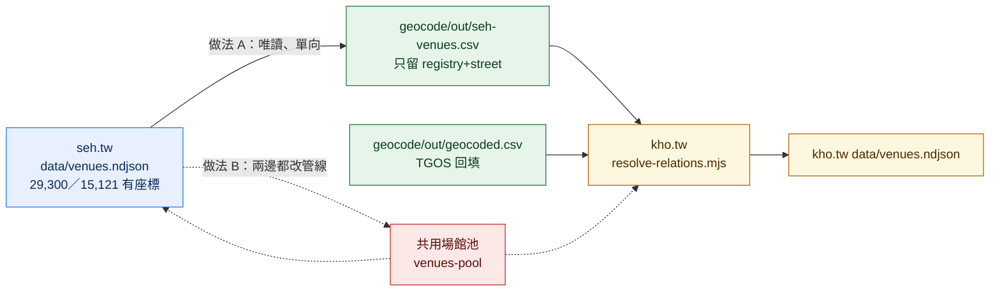

# 與 seh.tw 共用場館資料：可行性實測（2026-09-13）

回答 README §5 第 5 項：「查 seh.tw 現有來源裡哪些已經是圖書館／文化中心，確認 venue pool 是否能直接共用」。

本文全部數字都是當下實跑兩邊的 `data/venues.ndjson` 量出來的，不是估計。量測腳本是臨時的，沒有留在專案裡。

> **更正 `probe/2026-09-11-sources.md` §0.5**：當時寫「seh.tw 的 venue pool 目前只有規格，還沒有資料」。這句已經過時——seh.tw 的 `transform/` 在 9/12 已完成，`data/venues.ndjson` 有 29,300 筆、15,121 筆帶座標，且進版控。

---

## 0. 結論

**不建議做。兩種共用做法都先不要動，理由是重疊太少。**

1. 兩站場館的重疊是 **164 個**（kho.tw 2,146 個場館的 **7.6%**），其中 seh.tw 那邊有座標、能真的拿來補的是 **88 個場館、1,184 門課**。
2. 這 1,184 門課裡有 **1,154 門的門牌已經在 TGOS 待比對名單上**，TGOS 回來就會解掉。seh.tw 與 TGOS **不是互補，是高度重複**——seh.tw 獨有的只有 27 個場館、129 門課。
3. 再扣掉 kho.tw 自己正在接的公共圖書館名錄（`ingest/sources/national-public-libraries.mjs`，與 seh.tw 同一個 dataset 99567，615 館 100% 有座標），seh.tw 的獨家貢獻只剩 **65 個場館、1,088 門課**。
4. 座標覆蓋率：現況 21.3%，**接了 seh.tw 是 21.7%**（在 TGOS 也回來的前提下，是 56.1% → 56.5%）。
5. **真正的洞不在這裡**：目前無座標的場館裡有 **794 個（3,992 門課）的門牌既不在 TGOS 待送名單、seh.tw 也沒有**，原因是 `geocode/out/tgos_upload.csv` 是 9/11 用 5 支來源建的，之後接的 6 支來源（軒恩、共用平台、新北、臺中、樂學網、就業通）的地址從來沒進過那個檔。**重跑一次上傳檔的收益是接 seh.tw 的 30 倍，工卻差不多。**

如果將來還是要做，選**做法 A（單向唯讀借用）**，而且只吃 `origin=registry` ＋ `addressPrecision=street` 那一層。理由見 §5、§6。

---

## 1. seh.tw 的場館資料長什麼樣

專案位置：`/Users/lightman/weiqi.kids/seh.tw`（與 kho.tw 同層）。

| | |
|---|---|
| 檔案 | `/Users/lightman/weiqi.kids/seh.tw/data/venues.ndjson` |
| 格式 | NDJSON，一行一個場館，6.9 MB |
| 筆數 | **29,300** |
| 有地址 | 17,367（59.3%） |
| 有座標 | **15,121（51.6%）** |
| 版控 | 進 git（`data/observation/` 與產出的 `venues.ndjson`、`relations.ndjson`、`buildings.json` 都在版控裡） |
| 產生者 | `transform/resolve-relations.mjs`，由 `npm run pipeline` 帶起來 |

欄位（取自實際第一筆）：

```json
{"id":"ent_cip-culture-halls_1","slug":"基隆市原住民文化會館","origin":"registry","name":"基隆市原住民文化會館","city":"基隆市","district":"中正區","address":"基隆市中正區正濱路116巷75號","addressPrecision":"street","lat":25.1816,"lng":121.7743,"sourceCount":1}
```

`origin` 只有兩種：`registry` 28,723（名錄來的）、`derived` 577（從活動資料長出來的）。另有 `buildingId`（座標 100 公尺分群出的母建築）。

### 1.1 座標哪裡來：全部是開放資料自帶的，seh.tw 沒有做地理編碼

整個 seh.tw 專案 grep 不到任何 geocode／TGOS／nominatim 的程式或設定（只有 `ingest/catalog/data-gov-datasets.csv` 提到字串）。座標一律是來源自己給的；`derived` 場館的座標則是活動資料的場次自帶經緯度。

這代表**兩站在地理編碼這件事上沒有可共用的成果**——kho.tw 的 TGOS 批次是 kho.tw 獨有的能力，seh.tw 也沒有可以反過來借的編碼器。

依來源拆解（用 id 的 `ent_<sourceId>_<recordId>` 前綴對 `ingest/sources/` 的 31 支來源還原）：

| 來源 | 場館數 | 有座標 | 座標率 |
|---|---:|---:|---:|
| moc-emap-poi（文化部文化資源地理資訊 POI） | 14,382 | 13,353 | 92.8% |
| tcmb-culture | 11,324 | 0 | 0.0% |
| moc-perform-place | 767 | 0 | 0.0% |
| national-public-libraries（公共圖書館名錄） | 615 | 615 | 100.0% |
| （derived，從活動長出來） | 577 | 414 | 71.8% |
| moc-community | 529 | 435 | 82.2% |
| taipei-culture-venues | 130 | 0 | 0.0% |
| kaohsiung-neighborhood-centers | 107 | 107 | 100.0% |
| taipei-public-libraries | 70 | 70 | 100.0% |
| tainan-public-libraries | 45 | 45 | 100.0% |
| ntpc-museum-venues | 34 | 34 | 100.0% |
| cip-culture-halls | 28 | 28 | 100.0% |

**有座標的部分幾乎全集中在兩支**：`moc-emap-poi` 佔 13,353（88.3%）、`national-public-libraries` 佔 615。要借只需要借這兩支。

反過來，`tcmb-culture`（11,324 筆）與 `moc-perform-place`（767 筆）合計 12,091 筆是 0% 座標，佔 seh.tw 場館池的 41%，對 kho.tw 完全沒有用。

### 1.2 更新機制

- 名錄類來源的重抓節奏（`docs/scheduling.md`）：宣告「每年」的名錄 **14 天**起跳，min 7 天、max 30 天；連續沒變動可以沉到 30 天。
- `venues.ndjson` 本身不是逐步更新，是每次跑 `transform/resolve-relations.mjs` **整份重算重寫**。
- id 的穩定性：`cluster.mjs:329` 是 `${kind}_${seed._source}_${idPart(seed._sourceRecordId)}`，也就是**綁來源的記錄 id**，只要來源不改編號就穩定；`derived` 的 id 是 `ven_derived_<名稱 slug>`，**改名就會換 id**。

---

## 2. kho.tw 的場館資料長什麼樣

| | |
|---|---|
| 檔案 | `data/venues.ndjson`，498 KB |
| 筆數 | **2,146** |
| 有地址 | 1,884（87.8%） |
| 有座標 | **249（11.6%）**，全部來自 `sports-venues` 名錄 |
| `source` | `registry` 746／`derived` 1,400 |

邊（`data/relations.ndjson`）29,059 條：`resolved` 24,606、`dangling` 4,453；**帶座標的 6,176 條（21.25%）**，就是「21.3% 的課有座標」這個數字的來源。

（`docs/pipeline.md` §4 寫的是 6,046/29,394，那是 9/12 那一輪的數字，與現在的檔案對不上，本文一律以當下實測為準。）

### 2.1 場館是怎麼從課程長出來的

`transform/resolve-relations.mjs`，一個 cluster（一門課）解析一次，依序試：

| 順位 | 方法 | method | confidence | 實測命中 |
|---|---|---|---|---:|
| 1 | 門牌對名錄 | `registry-address` | 0.95／0.8 | 10,992 |
| 2 | 場地名對名錄（含去縣市前綴） | `registry-name` | 0.95／0.8 | 4,567 |
| 3 | 門牌查 `geocode/out/geocoded.csv` | `geocoded-address` | 0.95 | 0 |
| 4 | 只有門牌，建無座標場館 | `derived-address` | 0.6 | 5,179 |
| 5 | 只有場地名 | `derived-name` | 0.4 | 3,868 |
| 6 | 都沒有 → 懸空邊 | `none` | 0 | 4,453 |

比對規則的關鍵在兩個正規化函式，**要共用資料就必須沿用它們**：

- `normAddress()`：全形轉半形、`台`→`臺`、去郵遞區號、去括號內容、中文數字門牌轉阿拉伯（「六號」→「6號」）、`12-3號`→`12之3號`，最後只留到「號」為止。
- `normVenueName()`：`台`→`臺`、去空白與全半形括號；另外會**多存一個去掉縣市前綴的鍵**，讓「臺中市大里國民暨兒童運動中心」對得上名錄的「大里國民暨兒童運動中心」。

第 3 順位目前是空的，因為 `geocode/out/geocoded.csv` 還不存在——TGOS 結果還沒回來。`loadGeocoded()` 讀不到檔案時回空 Map，是預期行為。

---

## 3. 重疊程度（本文最重要的數字）

比對方法：兩邊都套 kho.tw 的 `normAddress()` 與 `normVenueName()`，然後

- **門牌完全相同**，或
- **名稱完全相同且縣市相同**（名稱長度 ≥ 4 字）

縣市取自 `city` 欄位，缺的話從門牌開頭推。

```
kho 場館 2,146　seh 場館 29,300
重疊 164（門牌 156、名稱+縣市 8）　未重疊 1,982
其中 seh 那邊有座標的 143
可補座標的 kho 場館 88 個，涵蓋課程 1,184 門
```

**重疊率 164 / 2,146 = 7.6%。**

### 3.1 為什麼只有 7.6%

因為兩站的場館語意本來就不同。seh.tw 的「場館」是**辦過文化活動的地點**（公共藝術、古蹟、工藝工作室、演藝團體登記地址），kho.tw 的是**上課地點**（社大教室、國中小、運動中心、里活動中心）。重疊場館依 kho.tw 這邊的名稱分類：

| 類型 | 重疊數 |
|---|---:|
| 其他 | 49 |
| 學校（國中／國小／高中／大學） | 45 |
| 活動中心 | 17 |
| 樂齡 | 11 |
| 圖書館 | 10 |
| 運動 | 6 |
| 藝術／文化館／文化中心／公所 | 5 |

README 當初預期的「圖書館、文化中心、社教館兩邊都會用到」**方向對，但量遠比預期小**：圖書館只有 10 個、文化中心 1 個。重疊最大宗反而是學校（45 個）——因為文化部的 emap POI 收了很多校園裡的公共藝術，剛好與社大的上課地點同門牌。

### 3.2 抽樣例子（seh.tw 有座標、kho.tw 沒有）

門牌對上的：

```
高雄文學館          高雄市前金區民生二路39號   1 門 → seh「高雄市立圖書館高雄文學館」 22.62556, 120.298013
橋頭圖書館          高雄市橋頭區隆豐路7號      2 門 → seh「高雄市立圖書館橋頭分館」   22.7579, 120.3063
彌陀公園圖書館      高雄市彌陀區中正路281巷50號 3 門 → seh「高雄市立圖書館彌陀公園分館」22.7855, 120.2462
名間分校            南投縣名間鄉彰南路220號    14 門 → seh「深耕易耨」（公共藝術）    23.845168, 120.698128
他里霧微光草原聚落  雲林縣斗南鎮南昌路17號      2 門 → seh「他里霧繪本館」            23.677137, 120.47608
衛武營藝術村        高雄市鳳山區輜汽路281號     1 門 → seh「號角響起」（公共藝術）     22.616853, 120.338915
```

名稱＋縣市對上的：

```
新北市立圖書館萬里分館  （kho 無地址）          1 門 → seh 同名   25.179791, 121.689661
西螺廣福宮              雲林縣西螺鎮新街路32號   1 門 → seh 同名   23.797228, 120.464839
新北市客家文化園區      新北市三峽區隆恩街239號  3 門 → seh 同名   24.941709, 121.359823
龍子里活動中心          中華一路2133巷47號       5 門 → seh 同名   22.653651, 120.296364
```

注意第 4、6 例：seh.tw 的場館名是**公共藝術作品名**，不是場館名。借座標可以，**借名稱會把課程頁的地點寫成「深耕易耨」**，所以只能借 `lat`／`lng`，絕不能借 `name`。

### 3.3 比對品質：用 kho.tw 已知的 249 個座標做交叉驗證

兩邊都有座標的 55 對，比對它們的距離：

```
中位數 93m　p90 638m　>500m 的有 7 對
```

離群的 7 對全部是**同一個門牌、不同的實體**：

```
6,278m  元智大學體育館（桃園市中壢區遠東路135號）      vs seh「天河書屋」
6,287m  國立基隆女子高中游泳池（基隆市信義區東信路324號） vs seh「海神樂章」
1,289m  頭前國中田徑場（新北市新莊區中原路2號）         vs seh「跳躍青春」
  741m  高雄大學排球場（高雄市楠梓區高雄大學路700號）    vs seh「生態迴環」
  645m  東大附中籃球場（臺中市西屯區臺灣大道四段1727號） vs seh「東海大學早期校園」
  638m  中興大學排球場（臺中市南區興大路145號）         vs seh「人文種子」
  585m  光復校區籃球場（臺南市東區大學路1號）           vs seh「成功大學博物館」
```

**成因**：校園、園區這種大基地共用一個門牌，門牌只定位到大門，校內設施可以散在幾公里外。這不是比對錯誤，是**門牌式定位的先天上限**——TGOS 門牌比對回來的座標會有一模一樣的問題，只是誤差方向不同。

實務含意：借來的座標**適合縣市／行政區層級的分面與列表，不適合當「附近」功能的精確點**。若將來要做地圖或「附近的課」，大專院校與園區類場館要另外處理。

依 seh.tw 的來源可信度分層看，品質差距很明顯：

| 分層 | 可補場館 | 涵蓋課程 | 交叉驗證中位差 | >500m |
|---|---:|---:|---:|---:|
| `registry` ＋ `addressPrecision=street` | 84 | 1,166 | 93m | 7 |
| `registry` ＋ 其他精度 | 0 | 0 | — | — |
| `derived`（從活動長出來） | 4 | 18 | 111m | 0 |

**只有 `registry` ＋ `street` 這層有量**，其餘可以整層不要。

### 3.4 名稱包含式比對：試過，不建議用

想多撈一點的話可以放寬成「同縣市、名稱互相包含、候選座標唯一」。實測額外多 20 個場館、99 門課，但誤判很明顯：

```
臺北市文山區興隆路一段238之1號  →  seh「台北市文山區」（行政區層級的 POI）
六順多功能活動中心              →  seh「臺中市東區六順多功能活動中心公共藝術推廣案」
臺北市文山區景中街28號          →  seh「台北市文山區」
```

第 1、3 例會把一個門牌標到整個文山區的中心點，是**假精度**。為了 99 門課引入這種錯誤不划算，**不採用**。

（更寬鬆的版本——只對 kho 這邊限長度——會產生「龍山國中校本部 → seh『龍』」「安定中榮社區活動中心 → seh『活動』」這種，完全不能用。）

---

## 4. 對缺座標的實際幫助：與 TGOS 是重複，不是互補

先把目前 1,897 個無座標場館分桶（依門牌是否在 `geocode/out/tgos_upload.csv` 的 1,935 筆待比對名單、以及 seh.tw 是否補得到）：

| 分桶 | 場館 | 課程 |
|---|---:|---:|
| TGOS 待送 ∩ seh 可補 | 81 | 1,154 |
| 只有 TGOS 待送 | 700 | 8,969 |
| 只有 seh 可補 | 27 | 129 |
| 兩者皆無 | 1,089 | 8,178 |

**seh.tw 能補的 1,184 門課裡，1,154 門（97.5%）TGOS 本來就會解掉。**

座標覆蓋率推估（分母 29,059 條邊）：

| 情境 | 有座標的課 | 覆蓋率 | 相對現況 |
|---|---:|---:|---:|
| 現況 | 6,176 | **21.3%** | — |
| 只接 seh.tw（TGOS 永遠不回來） | 7,360 | 25.3% | +4.1pp |
| 只等 TGOS（假設 100% 命中） | 16,299 | 56.1% | +34.8pp |
| **TGOS ＋ seh.tw** | 16,428 | **56.5%** | +35.3pp |
| TGOS 命中 90% ＋ seh.tw | 15,415 | 53.0% | |
| TGOS 命中 80% ＋ seh.tw | 14,403 | 49.6% | |

**算法**：每個場館帶 `courseCount`，把「能補到座標的場館」的 `courseCount` 加總，除以 29,059。TGOS 命中率 100% 是上限假設（未查證，批次比對一定有比不到的門牌），所以附了 90%／80% 兩個保守情境。

**結論：接了 seh.tw，覆蓋率從 56.1% 變 56.5%，只多 0.4 個百分點。**

### 4.1 扣掉 kho.tw 自己在接的圖書館名錄，seh.tw 的獨家貢獻更小

`ingest/sources/national-public-libraries.mjs`（9/13 新增，目前正在接）抓的是 **data.gov.tw dataset 99567**，與 seh.tw 那支**同一個 dataset**。實測 `ingest/raw/national-public-libraries.json` 616 館，**615 館帶 `Longitude`／`Latitude`（99.8%）**，正規化程式已經寫了台灣範圍檢查。

這份名錄自己就能補 **23 個場館、96 門課**，而且**這 23 個 seh.tw 也全部補得到**（完全重複）。

扣掉之後：

```
seh.tw 的獨家貢獻 = 65 個場館 / 1,088 門課
```

### 4.2 真正的大洞：TGOS 上傳檔漏了 6 支來源

「兩者皆無」那 1,089 個場館（8,178 門課）裡，有很多門牌其實是完整可送的：

```
門牌完整且有縣市（可直接進下一批 TGOS）: 608 個 / 2,519 門
有門牌但缺縣市（補上縣市後可送）        : 186 個 / 1,473 門
不是門牌（校名／教室名等）              :  42 個 /   386 門
```

再加上 262 個只有場地名、沒有地址的場館（3,868 門課）。

**原因**：`geocode/out/address_map.csv` 的 `source` 欄位顯示，9/11 建上傳檔時只收了 5 支來源的地址：

```
moe-cc-1151 1108, moe-cc-sites 825, moe-senior-centers 365, taipei-cc 171, moe-cc-1152 109
```

之後接上的 `xuanen-centers`、`cc-shared-platform`、`ntpc-cc`、`taichung-cc`、`ntpc-ezlearn`、`taiwanjobs` 這 6 支，地址**從來沒進過上傳檔**。那 608 個「可直接送」的場館裡有 579 個是 `derived`（從課程長出來的），正是這 6 支來源帶進來的。

**這條路的收益是 794 個場館、3,992 門課（+13.7pp），是接 seh.tw（65 個場館、1,088 門課）的 3.7 倍場館數、30 倍相對於 TGOS 的增量**，而工作量只是重跑一次 `geocode/build_tgos_input.py`（最好順手改成直接從 `data/venues.ndjson` 收地址，而不是各來源各收一次）。

把兩批 TGOS 都算進來的話：16,299 + 2,519 + 1,473 ≈ **20,291 / 29,059 = 69.8%**（同樣是 100% 命中的上限假設）。

---

## 5. 兩種共用做法的取捨



### 做法 A：單向唯讀借用

kho.tw 讀 seh.tw 的 `venues.ndjson`，篩出可信的那層，轉成與 `geocoded.csv` 同格式的座標表。

**要改什麼**

1. 新增一支腳本（例如 `geocode/import-seh-venues.mjs`），讀 `../seh.tw/data/venues.ndjson`，篩 `origin === 'registry' && addressPrecision === 'street' && lat != null`，套 `normAddress()` 後寫出 `geocode/out/seh-venues.csv`（`address,lat,lng`）。只用 Node 內建模組，不需要 npm 套件。
2. `transform/resolve-relations.mjs` 的 `loadGeocoded()` 改成讀兩個檔並合併，**`geocoded.csv`（TGOS）優先**。約 15 行。

**風險**

- **跨專案路徑耦合**：兩個 repo 必須並排放。seh.tw 不在的機器上要能安靜跳過（`loadGeocoded()` 現有的 try/catch 模式可以沿用）。
- **兩邊會漂**：seh.tw 每次 `npm run pipeline` 會整份重寫 `venues.ndjson`，座標可能變、`derived` 場館改名會換 id。因為只借「門牌→座標」、不借 id 與名稱，漂移的影響侷限在座標值本身。
- **品質分層必須自己做**：不篩就會吃到 §3.3 那些 6 公里外的點，以及 41% 沒有座標的 `tcmb-culture`。
- **只能借座標**：seh.tw 的 `name` 可能是公共藝術作品名（§3.2），借了會污染課程頁的地點顯示。

**工**：半天（含驗證）。**收益**：65 個場館、1,088 門課的獨家貢獻；在 TGOS 也回來的情況下只有 +0.4pp。

### 做法 B：抽出共用場館池

把兩站的名錄來源抽成獨立資料集，兩站都從它取。

**要改什麼**

1. 新的 repo／目錄，統一 seh.tw 的 31 支名錄來源與 kho.tw 的 `sports-venues`、`moe-cc-sites`、`moe-senior-centers`、`national-public-libraries`。
2. 統一 id 命名空間：seh.tw 用 `ent_<source>_<recordId>`，kho.tw 用 `ven_<hash8>`。
3. 兩站的 `resolve-relations.mjs` 都改成讀共用池。
4. 兩站的 `dist/` 網址 `/venue/<id>.html` 會跟著變。

**風險**

- **語意不同會污染**：seh.tw 的 29,300 個「場館」裡有 11,324 筆 `tcmb-culture` ＋ 767 筆 `moc-perform-place` 是 0% 座標的非場館實體（文資、演藝團體）。直接併進來，kho.tw 會多出一萬多個沒有課、沒有座標的假場館頁。要併就得先定義「什麼算場館」，這是設計題不是工程題。
- **既有網址會變**：兩站都已經產出場館頁（kho.tw 2,146 個、seh.tw 依 `buildings.json` 另有母場館頁），換 id 等於換網址，有 SEO 成本。
- **兩站的更新節奏要對齊**：seh.tw 名錄 14 天、kho.tw 的 `registry` 也是 14 天，這點剛好一致，但共用池要自己有排程與健康檢查。
- **失敗模式變大**：共用池壞掉會同時打掉兩站。

**工**：3–5 天以上，而且要同時動兩個專案的管線。**收益**：與做法 A 完全相同的 1,184 門課。

### 比較

| | A 單向借用 | B 共用池 |
|---|---|---|
| 工 | 半天 | 3–5 天以上 |
| 動到 seh.tw | 否（唯讀） | 是 |
| 動到既有網址 | 否 | 是 |
| 座標收益 | +1,184 門（獨家 1,088） | 同左 |
| 主要風險 | 跨專案路徑、座標漂移 | 語意污染、網址變動、單點故障 |
| 可逆性 | 刪一支腳本即可 | 難 |

**收益一樣、成本差一個數量級**，所以若要做只會是 A。

---

## 6. 建議

1. **現在不接 seh.tw。** 重疊 7.6%、獨家貢獻 65 個場館／1,088 門課、覆蓋率只推 0.4pp（56.1% → 56.5%），不值得引入跨專案耦合。
2. **優先做這件事**：重跑 `geocode/build_tgos_input.py`，改成從 `data/venues.ndjson` 收地址（而不是各來源各收一次），把漏掉的 6 支來源補進下一批 TGOS。收益 794 個場館／3,992 門課（+13.7pp），工與做法 A 相當。順手處理那 186 個「有門牌但缺縣市」的地址——它們缺的縣市多半可從 cluster 的 `city` 欄位補回來。
3. **等兩個條件同時成立再回頭看這題**：(a) kho.tw 接了 22 縣市圖書館活動與各縣市文化局藝文研習（README §1.6），重疊會從 7.6% 明顯往上走；(b) TGOS 那條路走完，剩下的洞確定不是門牌問題。屆時直接做法 A，本文的篩選條件（`registry` ＋ `street`）可以直接沿用。
4. **不要做名稱包含式比對**（§3.4），假精度的代價大於 99 門課。
5. **`national-public-libraries` 那支繼續自己接**：同一個 dataset、615 館 100% 有座標，自己接比繞道 seh.tw 乾淨，而且不依賴另一個專案。

---

## 附：本文沒有查證的事

- **TGOS 批次比對的實際命中率**。§4 的 56.1% 是 100% 命中的上限假設，另附 90%／80% 兩個情境。結果回來前無法收斂。
- **seh.tw 的 `moc-emap-poi` 座標精度**。本文只用 kho.tw 已知的 249 個座標做了 55 對交叉驗證（中位 93m），樣本偏向運動場館，不足以代表全部 13,353 個 POI。
- **重疊的 164 個場館是否真的是同一個實體**。門牌相同不等於同一棟（§3.3 的大學校區就是反例）；本文把它當成「同一個定位點」處理，這對縣市／行政區層級的用途成立，對「附近」功能不成立。
